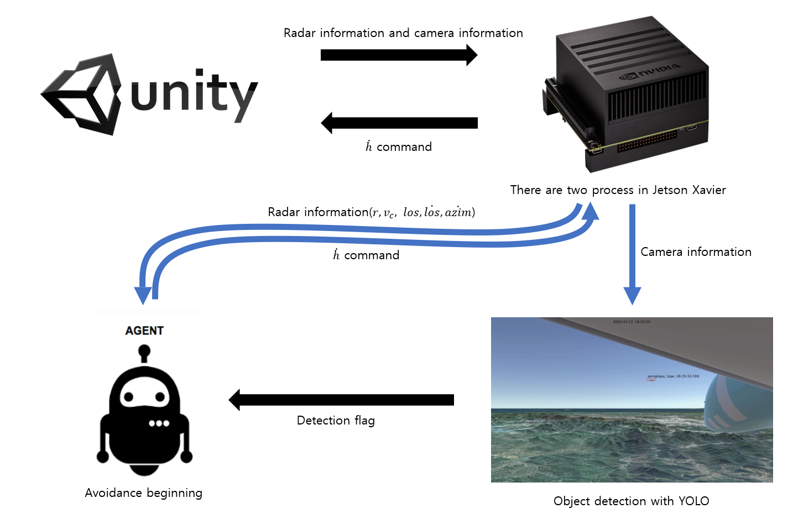
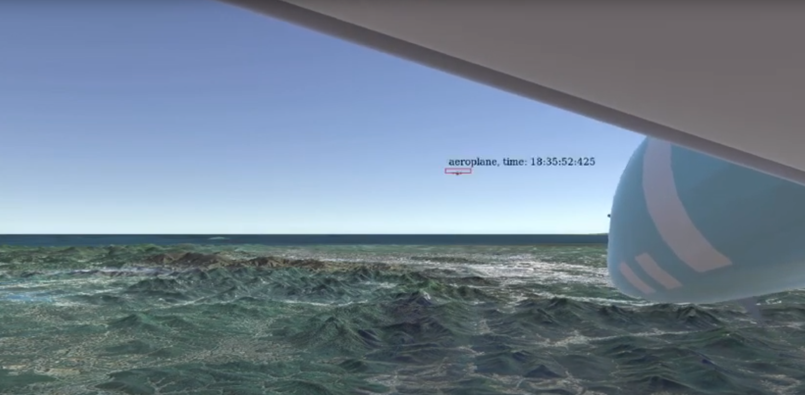
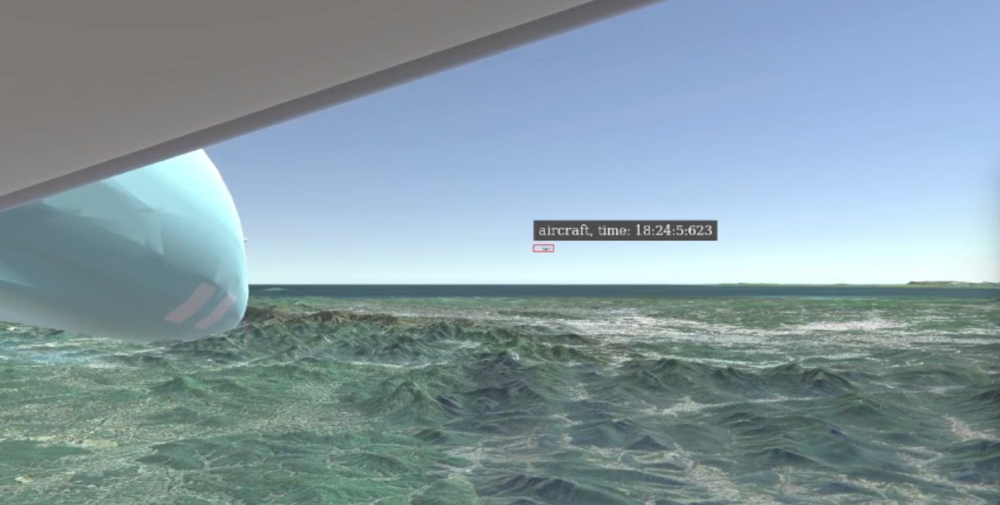
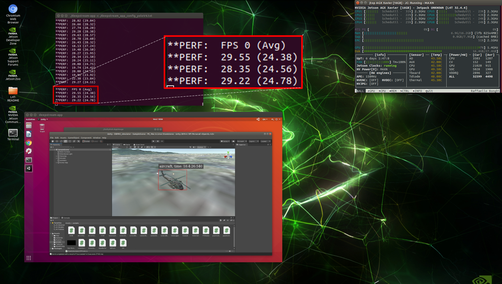
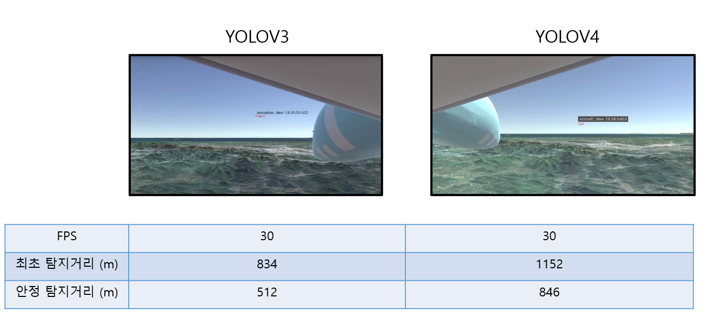
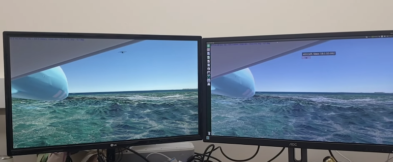
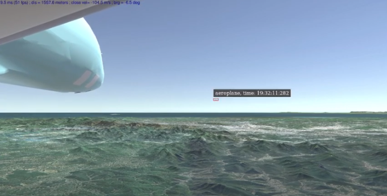

# YOLOV4_UDP_Jetson
| Directory | Contibutors | External Links |
| --- | --- | --- |
| [UDP_jetson](UDP_jetson) | 박건우 |
|[YOLOV4 Deepstream](custom_deepstream) | 박건우 |
| DBPAS | 인하대학교 | https://drive.google.com/file/d/1IMLpdmeMIFQ4wNjOqwPxfTnxNvAgnTA8/view?usp=sharing |

# Purpose of this research
본 연구의 목적은 영상기반 물체인식과 회피 프로그램의 융합 구현이다. 입력으로는 레이더 데이터 입력값과 카메라 입력값 두개가 주어지고, 카메라에 상대기가 detect되면, 회피기동을 시작하도록 고도 변화 명령을 출력으로 내보낸다. 본 연구의 간략한 overview는 아래와 같다. 본 Repo는 [Imitation_learning](https://github.com/kun-woo-park/Imitation_learning)에서 이어진다.
정리되지 않은 실험내용은 [collision_avoidance](https://github.com/aisl-khu/collision_avoidance)에서 확인할 수 있다.
## Overview of this research

본 과제의 개요는 위 그림을 따른다. 연산의 주가 되는 컴퓨터는 NVIDIA 사에서 개발한 Jetson Xavier라는 임베디드 플랫폼(Xavier)이다. 본 과제에서는 영상 데이터 수집을 위해 Unity로 구현된 항공기 시뮬레이터가 사용되는데, 이 항공기 시뮬레이터는 인하대학교 ASCL에서 제공한다. Unity 시뮬레이터를 가동하는 컴퓨터는 충분히 시뮬레이션의 부하를 감당할 수 있는 컴퓨터를 사용한다. 항공기 시뮬레이터는 [Imitation_learning](https://github.com/kun-woo-park/Imitation_learning)과 동일한 동역학을 따르며, 회피기의 날개에서 정면을 향하는 영상을 송출한다(회피기의 날개에 카메라가 달려있다고 가정). 매 프레임마다 Unity 시뮬레이터의 영상정보와 레이더 정보가 각각 Capture board와 UDP통해 Xavier의 입력으로 제공된다. 입력으로 받은 영상정보를 YOLOV4를 이용해 object detection을 한다. 이때   새(bird) 혹은 항공기(aircraft)가 인식되면, 회피 프로그램(딥러닝 모델 혹은 강화학습 모델(AGENT))에게 UDP로 detection flag를 전달한다. 회피 프로그램은 detection flag가 들어오면, Unity 시뮬레이터로부터 입력 받은 레이더 정보를 통해 회피기동을 진행한다.

먼저 YOLOV3 알고리즘(Deepstream, https://developer.nvidia.com/deepstream-getting-started) 을 
사용한 object detection 알고리즘과 Supervised Learning을 이용하여 학습시킨 모델을 Jetson xavier에 동시에 얹어 결과를 확인해 보았다. 해당 결과는 아래 링크를 참고하라.

## YOLOV3 with Collision avoidance model (Not communicated)
https://youtu.be/hm3EEg3RjYE

YOLOV3의 Detection 성능이 그리 좋지 않아, YOLOV4 알고리즘을 Deepstream으로 최적화하여 다시 실험을 진행하였다. 해당 결과는 아래 링크를 참고하라.

## YOLOV4 with Collision avoidance model (Not communicated)
https://youtu.be/rDMvdwizSz4

YOLOV4의 Detection 성능이 기존의 YOLOV3에 비해 월등히 뛰어남을 확인 할 수 있다. 또한 FPS역시 25-30 프레임 정도로 높은 FPS 결과를 보였다.

## YOLOV4 FPS on Jetson Xavier

## Compare YOLOV3 VS YOLOV4

YOLOV4를 얹은 상태에서 Delay를 확인한 결과 영상은 아래 링크를 참고하라.

## YOLOV4 Delay Check
https://youtu.be/8QWvEw6UdAg

이후에 Detection되는 class의 갯수를 aeroplane으로 줄이고 False Positive를 수정하자 Detection성능이 더욱 좋아졌다. 또한 이에 회피기동 알고리즘을 Detection Flag를 받으면 실행하도록 구현하였다.

결과는 아래 링크를 참고하라.

## YOLOV4 with Collision avoidance model (Communicated)
https://youtu.be/NvdkXGV38Dw

