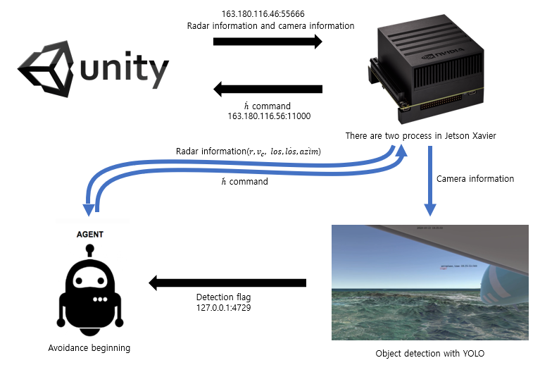

## UDP_jetson
본 폴더의 내용은 학습된 모델을 jetson xavier에 얹기 위해 작성된 UDP 코드이다.

## IP Setting
[UDP_methods.py](UDP_methods.py) 파일을 보면, setCMD 함수와 소켓을 정의해 두었다. 해당 코드는 다음과 같다.
```python
def setCMD(mode,roll, alpha, thrust,DBPAStakeOver):
    cmdPacket[0] = header1
    cmdPacket[1] = header2
    cmdPacket[2] = mode
    cmdPacket[3] = roll
    alpha=int(alpha)
    cmdPacket[4] = alpha
    cmdPacket[5] = thrust
    cmdPacket[6] = DBPAStakeOver
    sock.sendto(cmdPacket,(client_ip, client_port))
```
```python
import socket
results=[]
sock=socket.socket(socket.AF_INET, socket.SOCK_DGRAM)
sock.bind((host_ip, host_port))
```

여기서 client_ip는 163.180.116.46로, jetson xavier에 할당된 IP이고, client_port는 55666로, jetson xavier에서 개방한 port이다. 마찬가지로 host_ip는 163.180.116.56로, 항공기 시뮬레이터(Unity)가 올려져있는 서버의 IP이고, host_port는 11000로, 서버에서 개방한 port이다. 서버와 xavier는 해당 경로들로 서로 패킷을 주고받는다.

[UDP_methods.py](UDP_methods.py) 파일을 보면, 추가적으로 YOLOV4 Deepstream의 Detection Flag를 받도록 구현이 되어있는데, Local(127.0.0.1)의 4729 port로 Flag를 받게 된다. 이를 간략히 그림으로 나타내면 아래와 같다. 실행을 위한 파일은 [UDPjetson-connected.py](UDPjetson-connected.py)이다.

## Overview of UDP Communication

